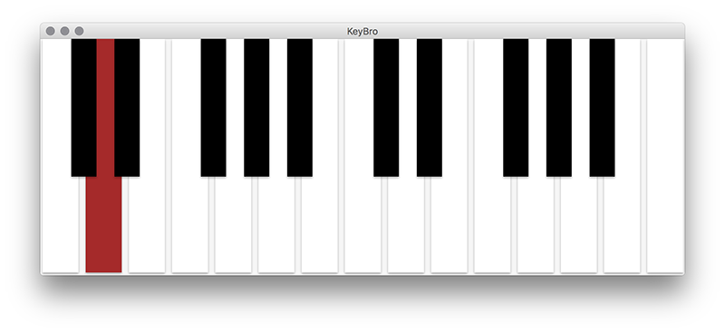

# MIDI KeyBro

OSX Electron based MIDI keyboard.

[Download App](https://github.com/sksmatt/MIDI-KeyBro/releases)

## Usage

#Download / Build

Download the latest build from the link above (or scroll down for notes on how to build yourself) unzip and place the KeyBro.app on ~/Applications.

#Enable Virtual MIDI Bus

KeyBro needs a virtual MIDI bus enabled on port 0. A virtual MIDI bus can be used to send MIDI messages between different applications.

**Mac**
On Mac, the IAC bus allows you to create any number of virtual MIDI buses. This driver is built-in to OSX (since OS X 10.4) and can be activated in the Audio/MIDI Setup Utility.

To begin, launch Audio/MIDI Setup and select "Show MIDI Window" from the "Window" menu.

Now double-click the IAC Driver icon and check the option "Device is online" in order to activate it.

You can rename the port as you wish from within this window.

Once this is done, the ports will appear in your host application (Live, Logic, Cubase, etc) and can be used to send or receive MIDI Note, MIDI Control Change and MIDI Sync messages.

## Build instructions (OSX)

- run `npm install`
- run `npm run build` to make MIDI KeyBro.app
- run `npm start` to run app from CLI without building KeyBro.app

## License

Shared under the MIT License

## Author

[Matt Varone](https://twitter.com/sksmatt/) @ 2016